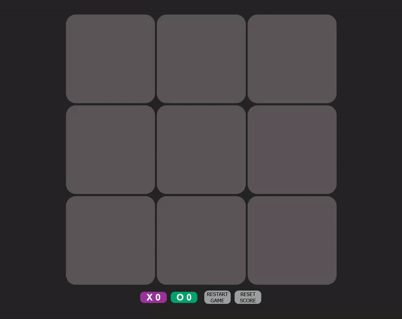

# Tic-Tac-Toe

## Overview
This project contains a simple tic-tac-toe game.

## Approach
To dictate the outcome of the game I used an array of DOM elements, containing the squares, and
an array of the possible win conditons. Then a nested loop was used to loop through both arrays and 
compare which letter was contained within the array of DOM elements. If a sub array of the winning conditions array
contained the same letter for all 3 indices, then a win was found and the current player score increases by 1.

## Technologies Used
* HTML
* CSS
* Javascript

## Preview

## Unsolved Problems

## Installation
* Fork and Clone
* Open index.html

## Future
Winning line should be highlighted.
